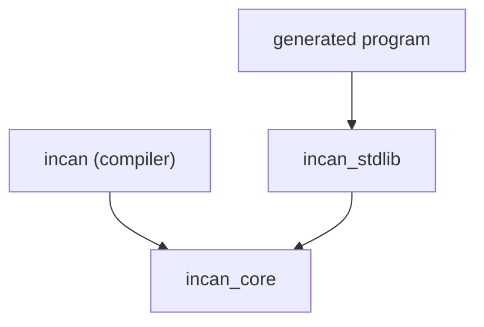

# Layering Rules

This repository follows a strict dependency direction to keep semantics shared and prevent accidental drift between the
compiler and the runtime:

- `incan` (compiler) may depend on `incan_core`.
- `incan` must **not** depend on `incan_stdlib` except as a **dev-dependency** for parity tests.
- `incan_stdlib` depends on `incan_core`.
- Generated user programs depend on `incan_stdlib`.

CI/Test guardrails enforce that `incan` keeps `incan_stdlib` out of its normal dependencies. If you need runtime helpers
inside tests, add them under `[dev-dependencies]` only.

## Why we do this

We want one “source of truth” for language behavior so the compiler and runtime don’t drift:

- **Semantics must match**: if const-eval validates something, runtime should do the same thing the same way (especially
  for Unicode-sensitive string operations and numeric edge cases).
- **Diagnostics/panics must stay aligned**: user-facing error messages should not diverge between compile-time and
  runtime.
- **Compiler stays lean**: the compiler shouldn’t accidentally pull in runtime-only APIs or heavy dependencies.

## What goes where (contracts vs implementations)

**`incan_core`**:

    - Pure helpers that define *meaning/policy* (e.g., string indexing/slicing rules, numeric promotion, canonical error
      message constants).
    - Must be deterministic and side-effect free.
    - Should not depend on compiler internals (AST, spans, lexer/parser state).

**`incan_stdlib`**:

    - Runtime helpers used by generated Rust code.
    - Should delegate behavior to `incan_core` for policy/consistency, and implement runtime-only actions (like
      panicking) using the shared error messages/taxonomy.

**`incan` (compiler)**:

    - Parsing, typing, lowering, codegen, diagnostics.
    - May use `incan_core` to implement checks/const-eval and to keep error text aligned.
    - Must not use `incan_stdlib` in normal builds; only in tests for parity.

## Allowed / forbidden dependencies

**Allowed**:

    - `incan` → `incan_core` (normal dependency)
    - `incan_stdlib` → `incan_core` (normal dependency)
    - `incan` → `incan_stdlib` (dev-dependency only, for tests)

***Forbidden**:

    - `incan` → `incan_stdlib` in `[dependencies]` (this breaks layering)
    - `incan_core` → `incan` or `incan_stdlib`

## Common pitfalls

- Adding a “quick helper” in `incan_stdlib` and calling it from the compiler.
    - Fix: move the policy/logic to `incan_core` and keep only runtime glue (panics, wrappers) in `incan_stdlib`.

- Emitting direct Rust operations that bypass shared semantics (e.g., slicing Rust `String` by byte indices).
    - Fix: emit calls to `incan_stdlib` wrappers which themselves delegate to `incan_core`.

- Duplicating error messages as string literals in multiple places.
    - Fix: put canonical text in `incan_core` and reuse it from both compiler and runtime.

## Guardrails (how it is enforced)

- **Dependency gate**: `tests/layering_guard.rs` fails if `incan_stdlib` appears in the compiler crate’s
    `[dependencies]` section of the root `Cargo.toml`. (Keeping `incan_stdlib` in `[dev-dependencies]` for parity tests
    is allowed.)

## How to add shared behavior safely

When you notice drift risk (compiler vs runtime):

1. Put the *policy* in `incan_core` (pure function + typed error or canonical message).
2. Add a thin wrapper in `incan_stdlib` that calls semantics and performs runtime-only behavior (panic, allocation,
   conversions).
3. Update compiler const-eval / typechecking to use the semantics helper directly (never stdlib).
4. Add a parity test in `tests/` that compares compiler/semantics/runtime behavior for the edge case.
