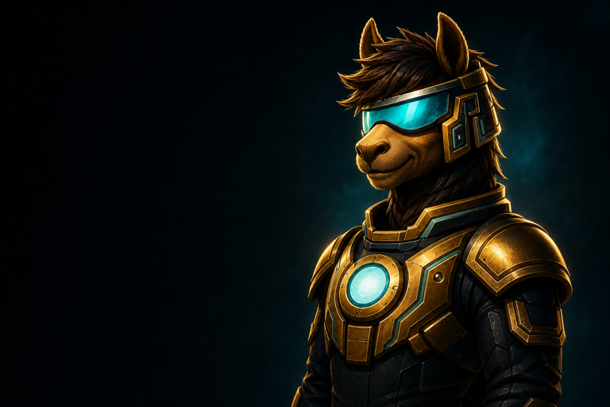

<!-- markdownlint-disable MD013 MD033 -->

<div class="inc-home" markdown="1">

<section class="inc-hero" aria-labelledby="incan-home-title" markdown="1">

<div class="inc-hero__copy" markdown="1">

<div class="inc-hero__brand">

</div>

<p class="inc-kicker">Programming language + compiler toolchain</p>

<h1 id="incan-home-title"><span>Readable source.</span><span>Native Rust binaries.</span></h1>

<p class="inc-hero__lead">Incan is a statically typed language for clear application code that ships as native Rust binaries. You keep the intent readable; the compiler handles ownership, diagnostics, and the build path.</p>

<div class="inc-hero__actions" markdown="1">
[Try Incan](tooling/tutorials/getting_started.md){ .md-button .md-button--primary }
[GitHub](https://github.com/encero-systems/incan){ .md-button }
[Read the Docs](start_here/index.md){ .md-button .inc-button--docs }
[Duckborrowing →](contributing/explanation/duckborrowing.md){ .inc-hero__text-link }
</div>

<div class="inc-hero__quickstart" aria-label="First Incan project">
<div class="inc-quickstart__terminal">
<div class="inc-quickstart__terminal-bar"><span>First run</span><strong>ready</strong></div>
<pre><code><span class="inc-terminal-line inc-terminal-line--command"><span aria-hidden="true">$</span> incan new hello --yes</span>
<span class="inc-terminal-line inc-terminal-line--output">Created project 'hello' at hello</span>
<span class="inc-terminal-line inc-terminal-line--command"><span aria-hidden="true">$</span> cd hello &amp;&amp; incan run</span>
<span class="inc-terminal-line inc-terminal-line--success">Hello from hello!</span></code></pre>
</div>
<div class="inc-quickstart__incus">
<a class="inc-quickstart__incus-link" href="project/incus/" aria-label="Meet Incus">

</a>
</div>
</div>

</div>

</section>

<section class="inc-section" aria-label="What you can build" markdown="1">

## Start from an outcome.

<div class="inc-route-grid">
  <a class="inc-route-card" href="tooling/tutorials/your_first_project/"><span class="inc-eyebrow">Application</span><strong>Build a real first project</strong><span>Split a native command-line project into public modules, meaningful tests, and a release build.</span></a>
  <a class="inc-route-card" href="tooling/tutorials/build_and_consume_library/"><span class="inc-eyebrow">Library</span><strong>Build a local package boundary</strong><span>Choose a small public API, build its checked library artifact, and run a locked workspace consumer.</span></a>
  <a class="inc-route-card" href="tooling/tutorials/pipeline_mini_project/"><span class="inc-eyebrow">Automation</span><strong>Build a typed workflow step</strong><span>Make inputs, successful output, failure, execution, and tests explicit in one deterministic native step.</span></a>
</div>

<p><a href="start_here/what_incan_is_for/">Check whether Incan fits</a> · <a href="start_here/index/">Choose a learning route</a> · <a href="start_here/incan_or_incql/">Choose Incan-shaped or IncQL-shaped work</a></p>

</section>

<section class="inc-section" aria-label="More executable projects" markdown="1">

## Build beyond the basics.

Incan 0.5 ships a full-standard-library Loaf and can explicitly bake project extensions for locked external dependencies. These tutorials carry that release envelope into services, typed data, asynchronous work, and Rust interop.

<div class="inc-route-grid">
  <a class="inc-route-card" href="language/tutorials/typed_data_processor/"><span class="inc-eyebrow">Typed data</span><strong>Run a typed data processor</strong><span>Model JSON, handle file failures, test the transformation, and produce a typed report.</span></a>
  <a class="inc-route-card" href="language/tutorials/build_your_first_api/"><span class="inc-eyebrow">Web</span><strong>Run a typed API</strong><span>Build a native server and exercise checked routes, path parameters, and response models.</span></a>
  <a class="inc-route-card" href="language/tutorials/async_worker_pipeline/"><span class="inc-eyebrow">Async</span><strong>Run an async worker</strong><span>Spawn tasks, preserve typed join failures, and bound slow work with a deadline.</span></a>
  <a class="inc-route-card" href="language/tutorials/add_a_rust_crate/"><span class="inc-eyebrow">Rust crate</span><strong>Bake a crate boundary</strong><span>Keep Rust-facing calls narrow, lock the dependency, and reuse an explicit project extension.</span></a>
</div>

</section>

<div class="inc-hero__flow" aria-label="Compiler flow">
<div class="inc-flow-step inc-tone-cyan"><strong>Write</strong><span>Readable typed source</span></div>
<span class="inc-flow-arrow"></span>
<div class="inc-flow-step inc-tone-gold"><strong>Plan</strong><span>Ownership without ceremony</span></div>
<span class="inc-flow-arrow"></span>
<div class="inc-flow-step inc-tone-cyan"><strong>Emit</strong><span>Inspectable Rust</span></div>
<span class="inc-flow-arrow"></span>
<div class="inc-flow-step inc-tone-cyan"><strong>Verify</strong><span>rustc checks the handoff</span></div>
<span class="inc-flow-arrow"></span>
<div class="inc-flow-step inc-tone-gold"><strong>Ship</strong><span>Native binary</span></div>
</div>

<section class="inc-section inc-build-strip" aria-label="Build path" markdown="1">

<p class="inc-strip-title">Readable source in. Native binaries out.</p>

<div class="inc-build-strip__grid">
<div class="inc-build-card inc-tone-cyan"><strong>Typed by default</strong><span>Types, errors, and mutability stay explicit.</span></div>
<div class="inc-build-card inc-tone-gold"><strong>Ownership planned</strong><span>Compiler-assisted ownership, not runtime guesswork.</span></div>
<div class="inc-build-card inc-tone-cyan"><strong>Rust emitted</strong><span>Generated Rust stays inspectable.</span></div>
<div class="inc-build-card inc-tone-cyan"><strong>Receipt checked</strong><span>Oven validates the resolved build plan before rustc runs.</span></div>
<div class="inc-build-card inc-tone-gold"><strong>Native binary</strong><span>No Python process model at deploy time.</span></div>
</div>

</section>

<section class="inc-section inc-section--code" aria-label="Code example" markdown="1">

<div class="inc-code-heading" markdown="1">

<div class="inc-section-intro" markdown="1">

## Incan vs Rust, side by side.

Same intent, same output. The Incan side stays Python-shaped and typed; Rust remains the artifact you can inspect when ownership and native deployment matter.

</div>

<div class="inc-code-proof__checks">
<span>Clear models</span>
<span>No borrow ceremony</span>
<span>Inspectable artifact</span>
<span>Native path</span>
</div>

</div>

<div class="inc-code-proof" markdown="1">

<div class="inc-code-compare" markdown="1">

<div class="inc-code-pane" markdown="1">
<p class="inc-code-label">Incan source</p>

```incan
model User:
    name: str
    age: int

def greet_user(user: User) -> str:
    return f"Hello, {user.name}!"

def main() -> None:
    user = User(name="Incan", age=42)
    println(greet_user(user))
```
</div>

<div class="inc-code-pane inc-code-pane--rust" markdown="1">
<p class="inc-code-label">Comparable Rust</p>

```rust
#[derive(Debug, Clone)]
struct User {
    name: String,
    age: i64,
}

fn greet_user(user: &User) -> String {
    format!("Hello, {}!", user.name)
}

fn main() {
    let user = User {
        name: "Incan".to_string(),
        age: 42,
    };
    println!("{}", greet_user(&user));
}
```
</div>

</div>

</div>

</section>

<p class="inc-code-caption">Readable enough for humans. Strict enough for compilers.</p>

<section class="inc-section inc-section--why" aria-label="Why Incan" markdown="1">

<div class="inc-section-title" markdown="1">

## Why Incan?

</div>

<div class="inc-why-grid">

<div class="inc-why-card inc-tone-purple">

<span>Readable application code without Python's runtime model.</span>
</div>

<div class="inc-why-card inc-tone-gold">

<span>Native artifacts without hand-writing every ownership path.</span>
</div>

<div class="inc-why-card inc-tone-cyan">

<span>A smaller surface for application intent, close to Rust semantics.</span>
</div>

<div class="inc-why-card inc-tone-cyan">

<span>Generated Rust, diagnostics, and build reports stay inspectable.</span>
</div>

<div class="inc-why-card inc-tone-gold">

<span>Locked Rust dependencies enter through an explicit project bake, then remain available through a sealed Loaf closure.</span>
<a href="language/tutorials/add_a_rust_crate/">See the boundary</a>
</div>

<div class="inc-why-card inc-tone-pink">

<span>Duckborrowing plans the handoff from clear source to Rust ownership.</span>
<a href="contributing/explanation/duckborrowing/">Learn more</a>
</div>

</div>

</section>

<section class="inc-brand-line" aria-label="Incan brand line">
<p><span>You write intent.</span><span>Incan writes ownership.</span></p>
</section>

<section class="inc-section inc-section--thesis" markdown="1">

<div class="inc-thesis-grid" markdown="1">

<div markdown="1">

## AI makes syntax cheaper. Toolchains matter more.

When source text is cheap, trust moves to the toolchain. Correctness, diagnostics, inspectability, and deployment matter more than syntax.

Incan is built for that shift: a smaller typed language surface with Rust-native artifacts.

</div>

<div class="inc-matters-card">
<strong>What matters most</strong>
<ul>
<li><span>Intent:</span> models, errors, and mutability stay explicit.</li>
<li><span>Diagnostics:</span> stable checks, explanations, and inspection data.</li>
<li><span>Inspectability:</span> generated Rust and build reports.</li>
<li><span>Deployment:</span> native binaries instead of a Python runtime.</li>
</ul>
</div>

</div>

</section>

<section class="inc-section inc-section--duck" markdown="1">

<div class="inc-section-intro" markdown="1">

## Duckborrowing in a nutshell.

Incan plans the Rust-facing ownership path. You keep writing clear application code.

</div>

<div class="inc-duck-diagram" aria-label="Duckborrowing flow">
<div class="inc-duck-step inc-tone-purple"><span>Python-shaped source</span></div>
<span class="inc-duck-arrow"></span>
<div class="inc-duck-step inc-tone-gold"><span>Ownership planning</span></div>
<span class="inc-duck-arrow"></span>
<div class="inc-duck-step inc-tone-cyan"><span>Borrow</span></div>
<span class="inc-duck-arrow"></span>
<div class="inc-duck-step inc-tone-cyan"><span>Move</span></div>
<span class="inc-duck-arrow"></span>
<div class="inc-duck-step inc-tone-cyan"><span>Clone</span></div>
<span class="inc-duck-arrow"></span>
<div class="inc-duck-step inc-tone-cyan"><span>Convert</span></div>
<span class="inc-duck-arrow"></span>
<div class="inc-duck-step inc-tone-cyan"><span>Owned storage</span></div>
<span class="inc-duck-arrow"></span>
<div class="inc-duck-step inc-tone-gold"><span>Generated Rust</span></div>
</div>

<p class="inc-duck-link"><a href="contributing/explanation/duckborrowing/">Read the Duckborrowing deep dive</a></p>

</section>

<section class="inc-final-cta" markdown="1">

<div class="inc-final-cta__copy" markdown="1">

## Try Incan. Break it. Help shape it.

Incan is beta software. Run it, inspect the generated artifacts, and compare it with Python and Rust on real application code. The project earns trust through feedback.

</div>

<div class="inc-hero__actions" markdown="1">
[Try Incan](tooling/tutorials/getting_started.md){ .md-button .md-button--primary }
[GitHub](https://github.com/encero-systems/incan){ .md-button }
[Read the Docs](start_here/index.md){ .md-button .inc-button--docs }
[Duckborrowing →](contributing/explanation/duckborrowing.md){ .inc-hero__text-link }
</div>

</section>

</div>
