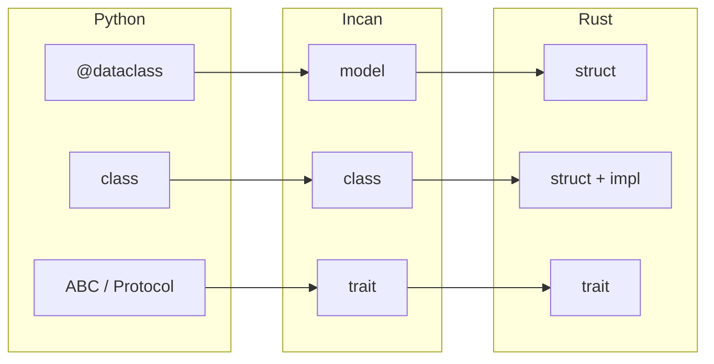

# Models and Classes in Incan

Incan provides two ways to define types with fields: `model` and `class`.
Understanding when to use each is key to writing idiomatic Incan code.

## Quick Comparison

| Aspect          | `model`                     | `class`                        |
| --------------- | --------------------------- | ------------------------------ |
| **Purpose**     | Data containers             | Objects with behavior          |
| **Focus**       | Fields first                | Methods first                  |
| **Inheritance** | No (cannot inherit)         | Yes (single inheritance)       |
| **Traits**      | Yes (behavior via traits)   | Yes (behavior via traits)      |
| **Use when**    | “This is data”              | “This is an object/service”    |

## When to Use Which

| Use Case             | Choose  | Why                                |
| -------------------- | ------- | ---------------------------------- |
| Config, settings     | `model` | Pure data, no behavior needed      |
| DTO, API payload     | `model` | Data transfer, serialization focus |
| Database record      | `model` | Represents stored data             |
| Service with methods | `class` | Has operations/behavior            |
| Stateful controller  | `class` | Methods that modify state          |
| Needs inheritance    | `class` | Only `class` supports `extends`    |

!!! info "Coming from Python or Rust?"
    A rough mapping (just to orient yourself):

    **Python -> Incan**

    - Python `@dataclass` / “plain data” / "pydantic BaseModel" -> `model`
    - Python “class with behavior” -> `class`

    **Rust -> Incan**  
    Both `model` and `class` compile to Rust `struct`s + `impl`s.
    The difference is semantic:
    
    - `class` can add inheritance (`extends`) and trait composition (`with ...`)
    - the compiler resolves this at compile time by generating fields/methods/trait impls
    
    In practice, this is still “zero-cost”: choose `model` vs `class` for clarity and API design, not for performance.

    **Why no `struct` keyword?**  
    If you're coming from Rust, you might wonder: "Where's `struct`?"  
    Incan uses `model` instead because:

    1. **Python familiarity** — Python developers know `class`, not `struct`
    2. **Clearer semantics** — `model` says "this is data", not "this is a memory layout"
    3. **Tooling conventions** — ORMs, validators, serializers all use "model" terminology

    Under the hood, both `model` and `class` compile to Rust `struct`s.

### Visibility (`pub`)

Control whether declarations are importable from other modules.

- Items are **private by default** (just like in Rust).
- Prefix a declaration with `pub` (publicly visible) to make it importable from other modules.
- For `model` and `class`, `pub` also makes fields public by default.

```incan
model User:           # private by default
    name: str

pub model PublicUser: # public model, fields are now public by default
    name: str

class Service:        # private by default
    repo: Repo
    def work(self) -> None:
        ...
```

!!! info "Coming from Python?"
    In Python, attribute visibility is a convention.  
    In Incan, item visibility is part of the language surface: items are private by default unless you mark them `pub`.
    You have to specifically opt-in to make items public.

## Model: Data-First

Models are for **data containers** — types where the fields are the primary concern.

```incan
# Simple data model
model Point:
    x: int
    y: int

# With derives for common behaviors
@derive(Eq, Hash, Serialize)
model User:
    id: int
    name: str
    email: str

# With default values
model Config:
    host: str = "localhost"
    port: int = 8080
    debug: bool = false
```

!!! info "Coming from Python?"
    An Incan `model` can be compared to a Python `dataclass` or Pydantic `BaseModel` in spirit.  

### What Models Get Automatically

By default, models (and classes) get `Debug` and `Clone`. Use `@derive(...)` to add additional behavior.

```incan
# Debug + Clone are implicit:
model User:
    name: str

# You only need @derive(...) when you want extra traits:
@derive(Eq, Hash, Serialize)
model User:
    name: str
```

### Models Cannot Inherit

Models intentionally do not support inheritance. Incan keeps `model` as a **data-first** construct: 

- inheritance makes the data shape implicit (fields come from “somewhere else”), 
- complicates defaults/constructors and derives/serialization, and
- introduces override-style complexity that belongs in `class`.

Prefer **composition** to keep the structure explicit and tooling predictable.

```incan hl_lines="4-5 9"
model Base:
    id: int

# ❌ Inheritance is NOT allowed
model Child extends Base:  # Error!
    name: str

model Child:
    base: Base  # ✅ Use composition instead
    name: str
```

## Class: Behavior-First

Classes are for **objects with behavior** — types where methods are the primary concern.

```incan
trait Loggable:
    def log(self, msg: str) -> None: ...

class UserService with Loggable:
    repo: UserRepository
    logger_name: str

    def log(self, msg: str) -> None:
        println(f"[{self.logger_name}] {msg}")

    def create_user(self, name: str, email: str) -> Result[User, ServiceError]:
        self.log(f"Creating user: {name}")
        user = User(id=next_id(), name=name, email=email)
        return self.repo.save(user)

    def find_user(self, id: int) -> Option[User]:
        return self.repo.find_by_id(id)
```

### Classes Support Inheritance

```incan hl_lines="7 13"
class Animal:
    name: str
    
    def speak(self) -> str:
        return "..."

class Dog extends Animal:
    breed: str
    
    def speak(self) -> str:
        return "Woof!"

class Cat extends Animal:
    indoor: bool
    
    def speak(self) -> str:
        return "Meow!"
```

### Mutable Methods

Use `mut self` when a method modifies the object:

```incan hl_lines="7-8 10-11"
class Counter:
    value: int

    def get(self) -> int:
        return self.value

    def increment(mut self) -> None:
        self.value = self.value + 1

    def add(mut self, n: int) -> None:
        self.value = self.value + n
```

## Both Can Implement Traits

```incan hl_lines="4-5 12-13"
trait Describable:
    def describe(self) -> str: ...

# Model implementing a trait
model Product with Describable:
    name: str
    price: float

    def describe(self) -> str:
        return f"{self.name}: ${self.price}"

# Class implementing a trait
class Employee with Describable:
    name: str
    title: str

    def describe(self) -> str:
        return f"{self.name}, {self.title}"
```

## Design Philosophy

Incan's type system follows the principle: **Python's vocabulary, Rust's guarantees**.



You think in Python terms, but get Rust's:

- Zero-cost abstractions
- Memory safety without GC (Garbage Collection)
- Compile-time guarantees

## See Also

- [Derives and Traits](../reference/derives_and_traits.md) — Adding behaviors with `@derive`
- [Error Handling](error_handling.md) — Using `Result` and `Option`
- [Example: models_vs_classes.incn](https://github.com/dannys-code-corner/incan/blob/main/examples/intermediate/models_vs_classes.incn)
