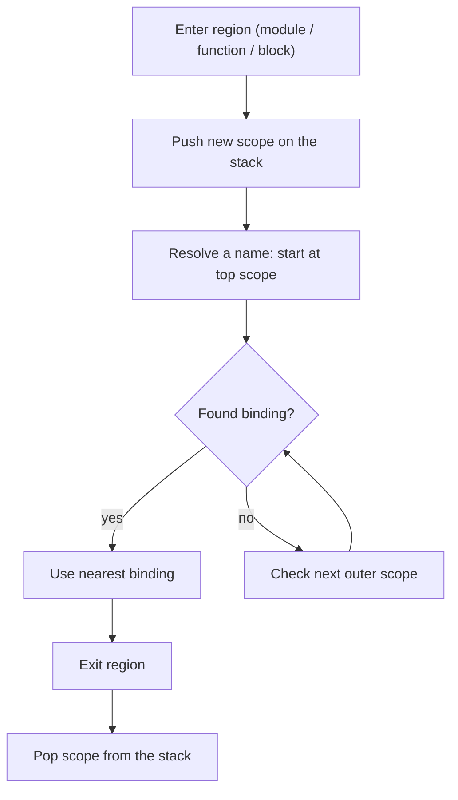

# Scopes & Name Resolution

Incan is **lexically scoped**: a name refers to the *nearest* binding in the surrounding source structure.

Two rules matter most in day-to-day code:

- Incan has **block scope**: most indented blocks introduce a new scope.
- Incan’s “plain assignment” (`x = ...` without `let`/`mut`) is **inferred**:
    - If `x` already exists in an enclosing scope, `x = ...` is a **reassignment** (so it requires `x` to be `mut`).
    - If `x` does not exist yet, `x = ...` creates a **new binding** in the current scope.

This page explains how those rules interact, and how to write clear, predictable code.

## Mental model

Think of the compiler keeping a **stack of scopes**. When you enter a new syntactic region (module, function, block, …)
it pushes a scope; when you leave it pops the scope. Name lookup walks from the top of the stack outward until it finds
a match.

This diagram shows how the compiler resolves a name:



Internally this is implemented by the compiler’s symbol table (`lookup()` searches outward; `lookup_local()` checks only
the current scope).

!!! note "Coming from Python?"
    Two differences tend to surprise people:

    - In Python, `if`/`for`/`while` blocks **don’t** create a new scope (so names can “leak” out of blocks).
    - Python resolves names with **LEGB** (Local → Enclosing → Global → Builtins), and has a key rule:
      **any assignment in a function makes that name local to the entire function**, unless you declare it
      `global`/`nonlocal`. In Incan, blocks are scopes and `x = ...` is inferred as “new vs reassign” by looking
      outward for an existing binding.

!!! note "Coming from Rust?"
    The spirit is similar (lexical scopes, `mut` for reassignment), but the surface syntax differs:

    - Incan’s `let x = ...` is the explicit way to introduce a **new binding** in the current scope (often used for
      shadowing).
    - Plain `x = ...` is context-sensitive: it either **reassigns** an existing `mut` binding, or introduces a new
      immutable binding if `x` doesn’t exist yet.

## What counts as a scope in Incan?

Here are the scopes Incan uses when resolving names.

### Module scope (file scope)

Everything at top level in a file lives in the **module scope**:

- `import` / `from ... import ...` bindings
- `const` bindings
- top-level function definitions, models/classes/enums, etc.

For example:

```incan
from math import sqrt            # module-scope binding
const PI: float = 3.14159        # module-scope binding

def area(r: float) -> float:     # module-scope binding (function)
    return PI * r * r            # uses module-scope name

model Circle:                    # module-scope binding (type)
    radius: float

def demo() -> float:
    c = Circle(radius=2.0)
    return sqrt(area(c.radius))  # `Circle`, `sqrt`, `area` resolved from module scope
```

In this example, the names `sqrt`, `PI`, `area`, and `Circle` are all resolved from the module scope.

### Function / method scope

Each `def ...:` body is a **function scope**.

Methods also have a function-like scope and define `self` (and `mut self`) for the method body.

For example:

```incan
const PI: float = 3.14159  # module scope

def area_scaled(r: float, scale: float) -> float:
    let base = PI * r * r        # PI: module, r: parameter, base: local
    return base * scale          # scale: parameter

model Circle:
    radius: float

    def area(self) -> float:
        return PI * self.radius * self.radius  # self: method scope, PI: module scope
```

In these examples:

- **Module-scope names**: `PI`, `Circle`, `area_scaled`
- **Function-scope names**: parameters like `r` and `scale`, plus locals like `base`
- **Method-scope names**: `self` (and anything you bind inside the method body)

### Block scope

Bodies of these constructs are checked in a **block scope**:

- `if` / `else`
- `while`
- `for`
- `if` expressions (treated as statement-like blocks in the current checker)
- list/dict comprehensions (the loop variable is local to the comprehension)

So variables defined in such blocks do **not** “leak out” to the surrounding scope.

## Bindings vs reassignment

Incan uses the same syntax `x = value` for both:

- creating a **new binding**, and
- **reassigning** an existing one.

The current rule is:

- `let x = ...` always creates a **new immutable binding** in the current scope (this is how you intentionally shadow).
- `mut x = ...` always creates a **new mutable binding** in the current scope (a fresh binding, but mutable).
- Plain `x = ...` is **inferred**:
    - if `x` already exists in any enclosing scope, it is a **reassignment** (so `x` must be mutable)
    - otherwise it creates a **new immutable binding** in the current scope

### `mut` controls reassignment

- A binding is **immutable by default**.
- You can only reassign a binding if it was declared `mut`.
- Shadowing an outer name is done with `let` (a new binding in the inner scope).

Example:

```incan
def reassigns_outer() -> int:
    mut x = 1

    if true:
        x = 2

    return x  # 2
```

Shadowing example (block-local):

```incan
def shadows_in_block() -> int:
    let x = 1

    if true:
        let x = 2  # new binding in the block scope (shadows outer x)

    return x  # still 1
```

Notes on `let`:

- `let x = ...` is the explicit form for “**introduce a new binding** in the current scope”.
- It’s **optional** when introducing a name for the first time (plain `x = ...` will do that if `x` doesn’t exist yet),
  but `let` is how you make **shadowing** unambiguous and readable in nested scopes.
- `mut x = ...` introduces a **new mutable** binding. Reassigning later uses plain `x = ...` (and requires that `x` was
  introduced with `mut`).

You get an error if you write this:

```incan
def errors_without_mut() -> Unit:
    let x = 1
    if true:
        x = 2  # error: cannot reassign immutable variable 'x'
```

That’s because plain `x = 2` is treated as a reassignment (since `x` already exists), and the outer `x` is immutable.

### Prefer explicit `let` / `mut`

Use `let`/`mut` when you care about whether you’re shadowing or reassigning; it avoids surprises and matches what you
intended.

Example:

```incan
def shadow_vs_reassign() -> int:
    mut x = 10

    if true:
        x = 11      # reassigns the *outer* x (because x already exists)
        mut x = 12  # creates a new mutable block-local x (shadows outer x in this block)
        x = 13      # reassigns the *inner* x (still in the block scope)

    return x  # still returns 11, as the x = 13 was assigned to a new x local to the if-block
```

## Closures and capturing

Incan closures use arrow syntax:

```incan
add1 = (x) => x + 1
```

Closures introduce their own function scope (parameters are local to the closure body). Names from outer scopes can be
**read** by normal lexical lookup.

Plain assignment inside a closure behaves the same as elsewhere: if the name exists already, it’s treated as a reassignment
(so it requires the outer binding to be `mut`). Shadow with `let` if you want a closure-local name.

Example:

```incan
def closure_capture() -> int:
    mut x = 1
    inc = () => x = x + 1  # reassigns outer x (so outer x must be mut)
    inc()
    return x  # 2
```

> Note: Incan does not expose Python-style `global` / `nonlocal` declarations.

## Common gotchas (and how to think about them)

- **“Why did `x = ...` inside an `if` error?”**
    - If `x` already exists, plain `x = ...` is treated as a reassignment, so `x` must be `mut`.
    - If you intended a new block-local `x`, use `let x = ...` in the block.

- **“Why does `x = ...` sometimes require `mut`?”**
    - Only *reassignment* requires `mut`. Plain assignment is inferred: it reassigns if `x` already exists; otherwise it
    creates a new immutable binding.

- **“Where do imported names live?”**
    - Imports add names to the **module scope** (file scope). Inside functions, you can refer to them like any
    other outer binding.

## See also

- [Imports & Modules](imports_and_modules.md) — module boundaries, exports (`pub`), and importing names
- [Closures](closures.md) — arrow syntax and when to use closures
