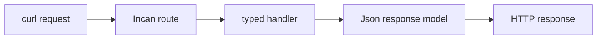

# Build a typed API

This tutorial builds and runs the included web application, then traces one request from a route declaration to a typed JSON response.

<aside class="inc-tutorial-meta" aria-label="Tutorial details">
  <dl>
    <div><dt>Reader</dt><dd>Service or application developer</dd></div>
    <div><dt>Prerequisites</dt><dd>Getting Started and the prepared 0.5 development toolchain</dd></div>
    <div><dt>Time</dt><dd>15–20 minutes</dd></div>
    <div><dt>Verified</dt><dd>Incan <code>&gt;=0.5.0-0,&lt;0.6.0</code>; native build and execution exercised with the full-standard-library Loaf</dd></div>
    <div><dt>Status</dt><dd>Release-envelope executable</dd></div>
    <div><dt>Outcome</dt><dd>A running native API with typed responses</dd></div>
    <div><dt>Artifacts</dt><dd>Native server and four route contracts</dd></div>
  </dl>
</aside>

<ol class="inc-step-rail" style="--inc-step-count: 3" aria-label="API tutorial steps">
  <li><strong>Run</strong>Start the native server</li>
  <li><strong>Request</strong>Exercise the route shapes</li>
  <li><strong>Trace</strong>Follow typed responses</li>
</ol>

Prerequisite: [Install and prepare the development toolchain](../../tooling/how-to/install_and_run.md#follow-the-05-development-docs).

## Step 1: Run the hello web example

The repository includes the complete source:

- Source: `examples/web/hello_web.incn`
- GitHub: `https://github.com/encero-systems/incan/blob/main/examples/web/hello_web.incn`

Build it, then start the server from the Incan repository root:

```bash
incan build examples/web/hello_web.incn
incan run examples/web/hello_web.incn
```

The normal commands reuse the checked `std.web`, async, and typed-serde closure in the toolchain's full-standard-library Loaf. They do not invoke Cargo on the consumer path.

## Step 2: Request the endpoints

With the server running, use another terminal:

```bash
curl http://127.0.0.1:8080/
curl http://127.0.0.1:8080/api/greet/World
curl http://127.0.0.1:8080/api/user/42
curl http://127.0.0.1:8080/health
```



<p class="inc-diagram-caption">The route selects a typed handler; the response model is serialized at the HTTP boundary.</p>

| Route | Checked return boundary |
| --- | --- |
| `/` | `Response` containing HTML |
| `/api/greet/{name}` | `Json[Greeting]` |
| `/api/user/{id}` | `Json[User]` with an integer path parameter |
| `/health` | successful `Response` |

<section class="inc-learning-panel inc-learning-panel--result" data-label="Expected" markdown="1">

The server answers all four routes through checked path-parameter, handler, and response-model boundaries.

</section>

## Step 3: Trace what you’re seeing

The example demonstrates:

- `@route("/path")` for routes (imported from `std.web.routing`)
- `Json[T]` for JSON responses
- `@derive(json)` for response models
- `async def` handlers (async/await)

Learn more:

- Web framework guide: [Web framework guide](web_framework.md)
- Models: [Models & Classes](../explanation/models_and_classes/index.md)
- Errors: [Error Handling](../explanation/error_handling.md)
- Modules: [Imports and modules (how-to)](../how-to/imports_and_modules.md)

<section class="inc-learning-panel inc-learning-panel--complete inc-incus-slot" data-label="Complete" data-incus-category="success" markdown="1">

You built and ran a native server, exercised four route contracts, and followed one request shape from route selection to a typed response model.

</section>

## Continue

- [Web framework guide](web_framework.md)
- [Error handling](../explanation/error_handling.md)
- [Build and consume an Incan library](../../tooling/tutorials/build_and_consume_library.md) to build a reusable package boundary
