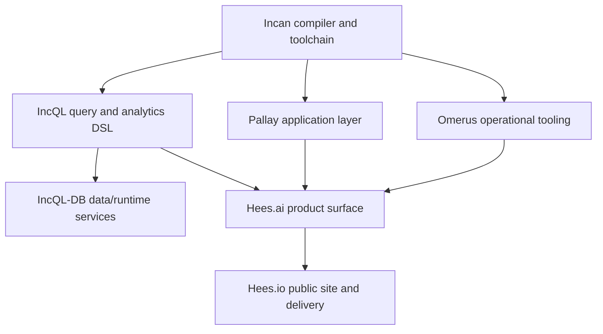

# Encero stack

Incan is the typed compiler substrate for the Encero stack. It is not the whole product story by itself: the goal is a set of domain tools that can use Python-like source ergonomics, native artifacts, Rust ecosystem boundaries, explicit metadata, and inspectable build facts without every project rebuilding those foundations independently.

Incan owns the language, compiler, package/build tooling, standard library, Rust interop, diagnostics, and inspection surfaces. IncQL, Pallay, and Omerus are downstream consumers that prove different kinds of product and data workflows. Hees.ai and Hees.io sit higher in the stack and should be referenced from Incan docs as stack context, not as implementation scope for the Incan compiler release.

For 0.5, the practical takeaway is concrete: an evaluator can install one release toolchain, create and test an application, publish a library, organize a workspace, cross a checked native boundary, and inspect the compiler facts behind those outcomes. The downstream products remain proof lanes for these foundations; they are stack context, not additional product scope hidden inside the Incan 0.5 release.
