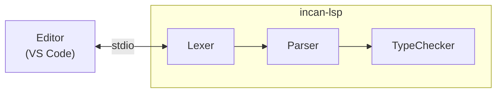

# LSP architecture

This page explains how the Incan Language Server works internally.

## High-level design

The LSP is built with [tower-lsp](https://github.com/ebkalderon/tower-lsp) and reuses Incan's compiler frontend.

On each file change, the LSP runs the compiler pipeline and reports:

- lexer errors (tokenization failures)
- parser errors (syntax errors)
- type errors (type mismatches, unknown symbols, etc.)
